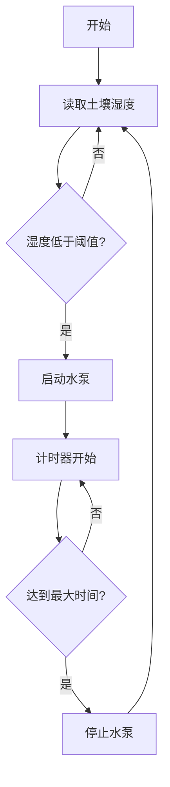

# ESP32-S3-BOX 智能浇水系统技术分析

本文档对 ESP32-S3-BOX 智能浇水系统的技术实现进行深入分析，包括硬件架构、软件设计、关键功能模块等方面。

## 1. 系统概述

该项目是一个基于 ESP32-S3-BOX 的智能浇水系统，集成了自动浇水、语音控制、远程监控等功能。系统通过土壤湿度传感器实时监测植物生长环境，并根据设定的阈值自动控制浇水，同时支持语音命令和手机 APP 远程控制。

## 2. 硬件架构

### 2.1 核心组件
- **主控制器**：ESP32-S3-BOX
- **传感器**：土壤湿度传感器
- **执行器**：水泵（通过继电器控制）
- **电源系统**：5V 和 3.3V 电源模块

### 2.2 GPIO 配置
1. **土壤湿度传感器接口**
   - GPIO11 (ADC 输入)
   - ADC 配置：
     - ADC 单元：ADC_UNIT_2
     - ADC 通道：ADC2_CHANNEL_0
     - ADC 衰减：ADC_ATTEN_DB_11
     - 最大输入电压：3100mV

2. **水泵控制接口**
   - GPIO41（继电器控制）
   - 配置为数字输出
   - 无上拉/下拉电阻

## 3. 软件架构

### 3.1 核心功能模块

#### 3.1.1 湿度检测模块 (app_humidity.c)
- ADC 数据采集和处理
- 湿度值校准和转换
- 支持回调机制进行状态通知
- 实时监测任务

#### 3.1.2 水泵控制模块 (app_pump.c)
- GPIO 控制逻辑
- 自动/手动模式切换
- 浇水时间管理
- 状态回调机制
- 配置参数持久化存储

#### 3.1.3 语音控制模块 (app_sr.c)
- 支持的语音命令：
  - "ting zhi jiao hua" (停止浇花)
  - "ting zhi jiao shui" (停止浇水)
  - "kai shi jiao hua" (开始浇花)
  - "kai shi jiao shui" (开始浇水)
- 音频数据采集和处理
- 语音识别算法集成

### 3.2 控制逻辑

#### 3.2.1 自动控制模式

#### 3.2.2 手动控制模式
- 触摸屏界面控制
- 语音命令控制
- ESP RainMaker APP 远程控制

## 4. 关键技术实现

### 4.1 ADC 采样与校准
- 使用 ESP32-S3 的 ADC2 进行模拟信号采样
- 支持多种校准方案：
  - 曲线拟合校准
  - 线性拟合校准
- 采样精度：12位 (0-4095)

### 4.2 语音识别
- 使用 ESP AFE (Acoustic Front End) 进行音频处理
- 支持中文语音命令识别
- 实时音频流处理

### 4.3 远程控制集成
- 集成 ESP RainMaker 云平台
- 支持实时状态同步
- 远程控制和监控功能

## 5. 安全特性

### 5.1 硬件安全
- GPIO 保护配置
- ADC 输入电压限制
- 继电器控制保护

### 5.2 软件安全
- 最大浇水时间限制
- 状态监测和异常处理
- 配置参数有效性验证

## 6. 优化建议

1. **硬件优化**
   - 添加水位传感器监测水箱水量
   - 集成多个湿度传感器提高准确性
   - 添加水流量传感器

2. **软件优化**
   - 实现智能浇水算法，根据历史数据调整浇水策略
   - 添加数据记录和分析功能
   - 优化语音识别的准确率

## 7. 总结

ESP32-S3-BOX 智能浇水系统是一个功能完整的智能家居应用示例，展示了如何利用 ESP32-S3 的各种硬件特性和软件功能构建实用的物联网应用。系统的模块化设计和完善的功能实现为类似项目提供了很好的参考。
